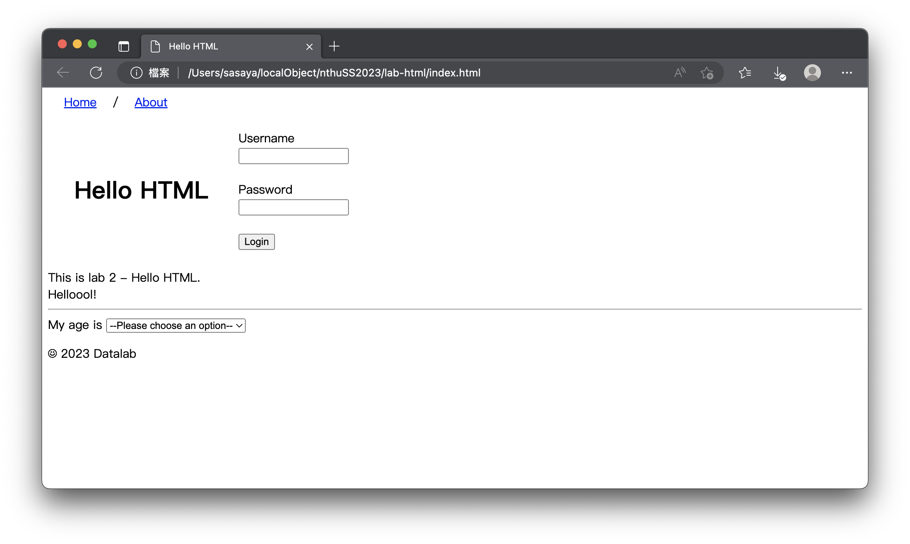
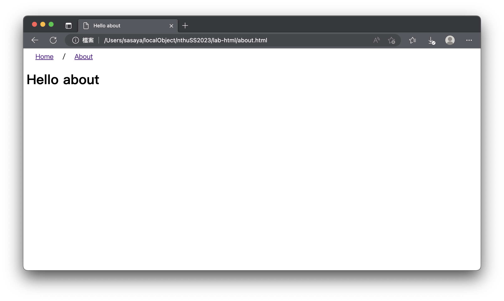
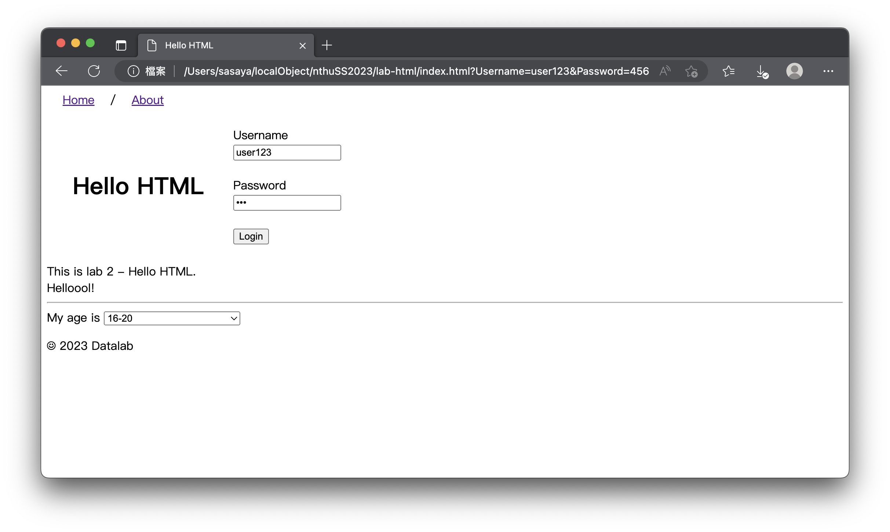

# Lab - My First HTML
We will learn how to create an HTML page in this lab. The final result will be like the image below:

## Grading
#### 1. Create a header: Home/About (20%)
* You will need to create a header on the top of both pages (10%)
* "About" should link to another page (10%)

#### 2. Create a table (40%)
* Header: Hello HTML (20%)
* Form: Username, password, and login (20%)
   * After clicking the "login" button, the username and password should be shown in the URL
#### 3. Paragraph, divider, and selector (40%)
* Type a paragraph with whatever you want! (10%)
* Add a line below to divide sections (10%)
* And a selector for selecting different ages (20%)
