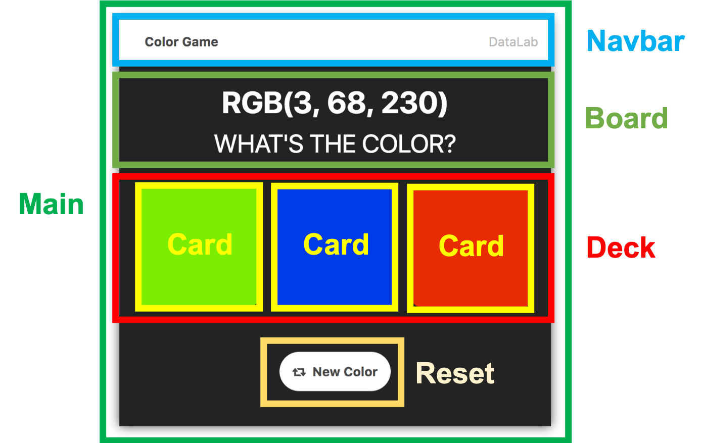

# Lab 3 - Color Game Component Based

 
In this lab, we will learn how to build a color game with component-based style.
1. Divide the screen into multiple components
2. Decide each component's work 
3. Create component.js to create and handle an event
3. Create .js and .css file for each components and inherits the methods and properties from component class
4. Start coding!  

Please finish the hard mode and nightmare mode with component-based style.  
The requirements of hard mode and nightmare mode are same as [previous assignment](https://shwu10.cs.nthu.edu.tw/courses/software-studio/2021-spring/lab-js-color-game).

## Grading
#### 1. Hard mode **(50%)**

#### 2. Nightmare mode **(50%)**

## Hint 
#### 1. Process
* After clicking the mode button, it will fire an event to notify its parent that the button has been clicked.
* The navigation bar will handle the click event and change the selected button to the button clicked by the user.
* The navigation bar will also fire an event to the main component and should tell it which mode has been clicked.
* The main component should handle the event and reset all components. The screen will change according to the selected mode.
* Remember .bind(this)!

## Submission
The deadline of this assignment is `2023/03/23 17:20`. 
When you open merge request, the title should be : `{your ID} Submission`

## Important
To test the code, you should run `npm install` first, then run `npm run build` or `npm run watch` sequently.

