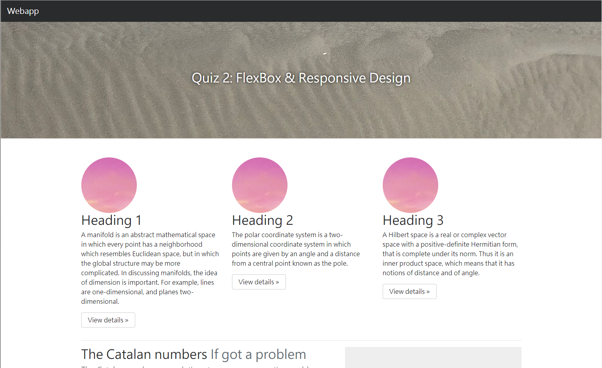
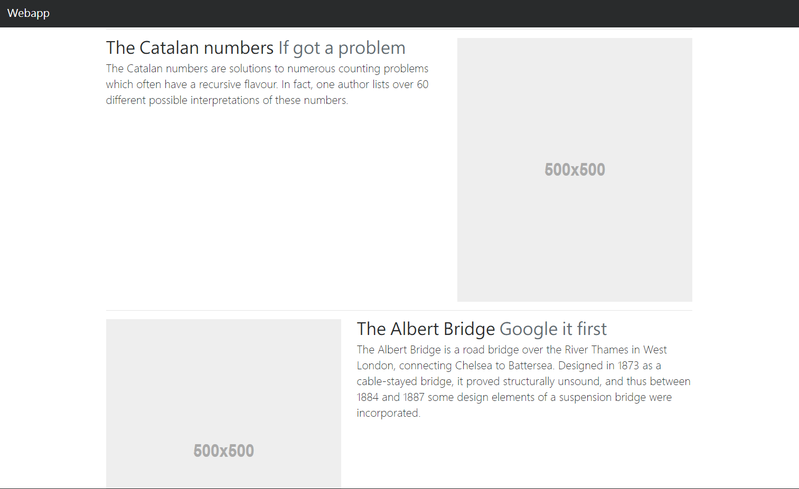
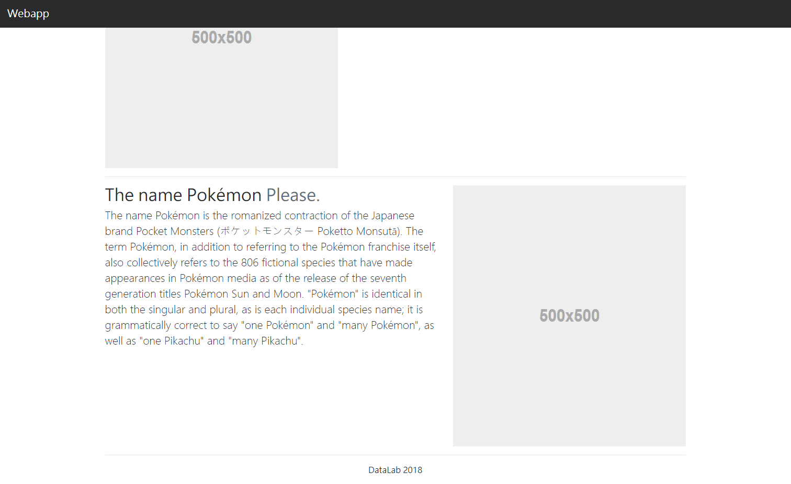
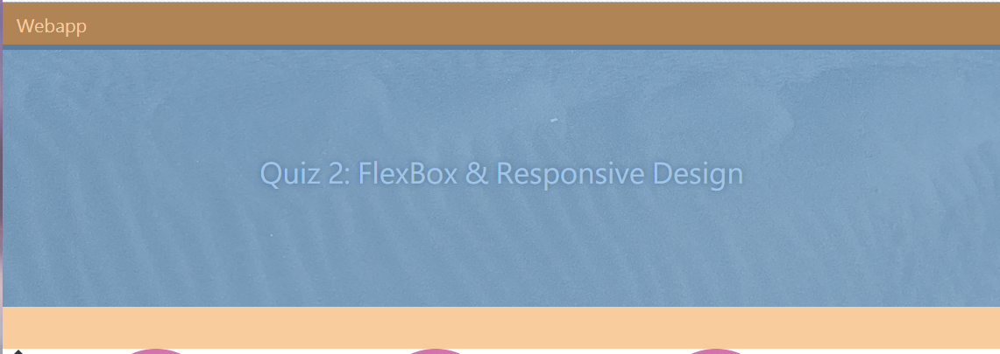
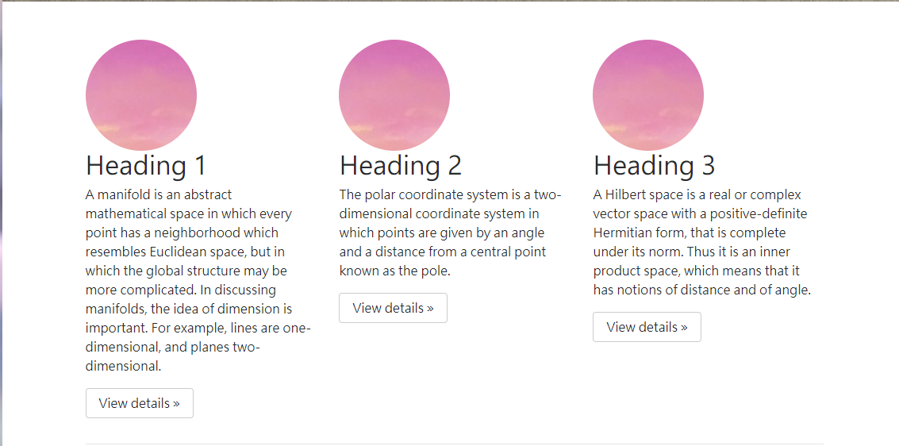
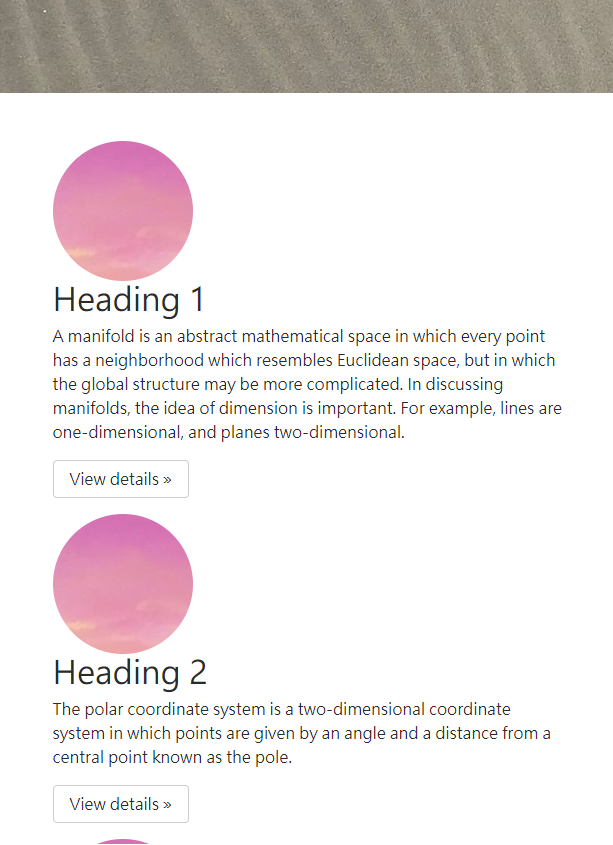
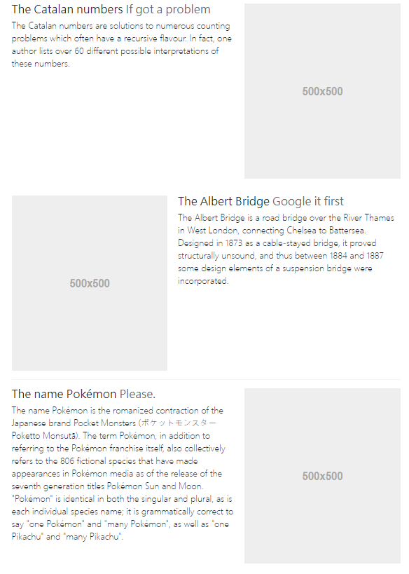
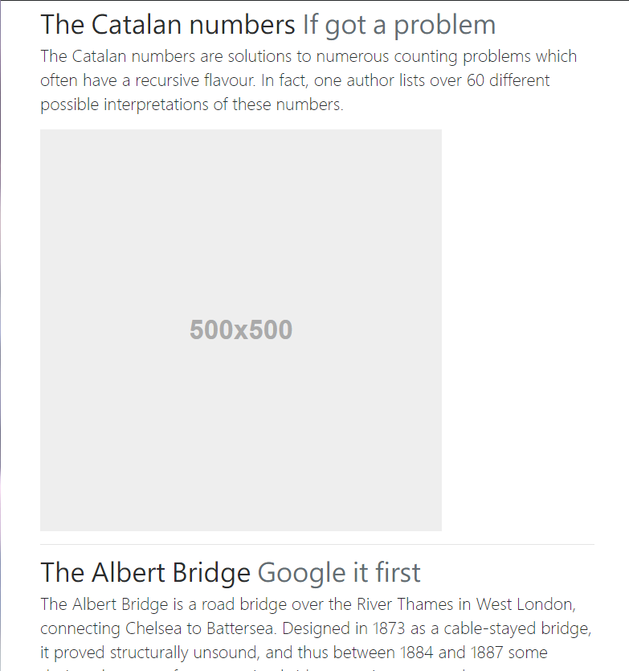

# Lab 4 - FlexBox & Responsive Design
  
  
  

## Grading

#### NOTE. Your result page do not need to be exactly the same as the example.

#### 1. Center Header (10%) 
  The text should at the center of both x-axis and y-axis of the header.  
 

#### 2. Gallery Part (40%) 
  (1) Let the three image-content-button objects equally share a row (25%) 
 
  (2) Responsive Display (15%) 
  The three objects should share a row only when the window size is large. 
  Otherwise, the page should display them from top to down:  
 

#### 3. Featurette Part (50%) 
  (1) Align Image and Text (30%) 
  For the first and the third row, image should be at right part and the corresponding texts should be at the left part 
  For the second row, image should be at the left part. 
 
<b>Note</b>: The image don't need to be 500*500px!   

  (2) Responsive Display (20%) 
  You should apply the align strategy in (1) only when the window size if large. 
   

## Submission
Open a new merge request when you finished your quiz.  
If you commit before the deadline but open the merge request after the deadline, you'll get 0 point. 
**DEADLINE**: 2023/03/30 17:20

## `IMPORTANT` 
From now on, we will not help you to deal with any git problems during the quiz. 
If there's nothing in your branch, you will get 0 points.
