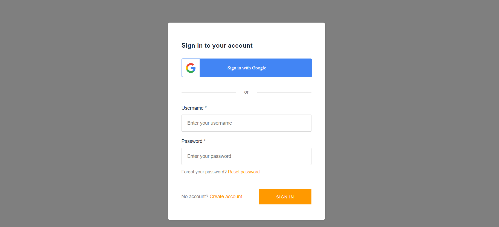
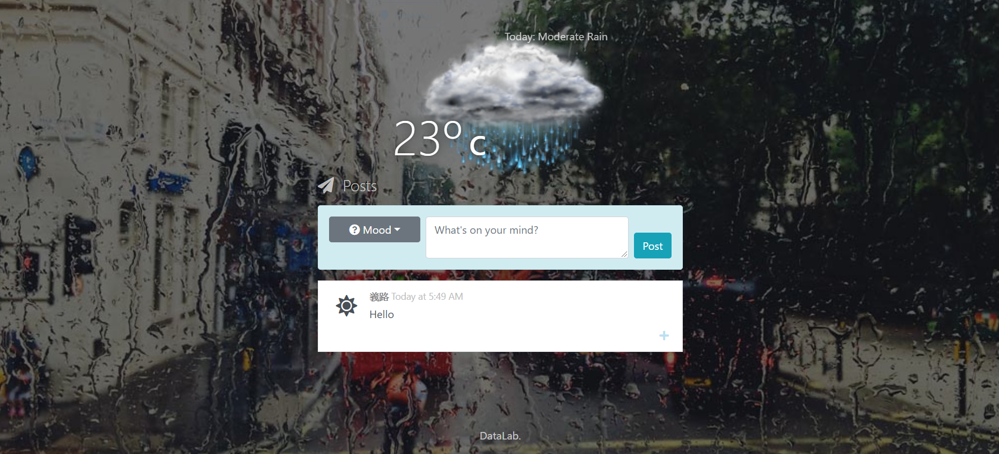

# Assignment - Weathermood Auth

In this assignment, you are asked to add basic authentication function to Weathermood, using AWS Amplify.
Only client side code is provided, this can run on localhost, no need to deploy on AWS.

## Requirement

1. (30%) Sign up / sign in with username and password.
2. (30%) Sign in with google account.

3. (20%) Custom greeting components in the NavBar, including username and logout button.
	- no need to look / place exactly same as the image below

4. (20%) On the Forecast page, show the author (sign-in username) of the todo in each TodoItem.
	- the below image shows postItem but it is the Forecast page you should complete with

## Submission

1. One submission per team, submit to the branch of your team.
2. Submit your work before 2023/05/25 (Thu) 23:59:59 
