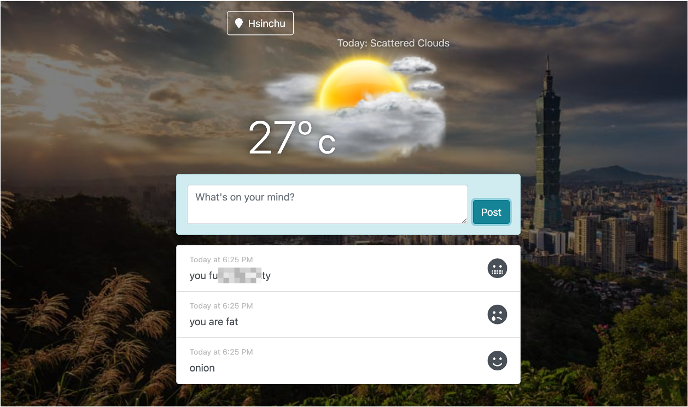

# Lab - Weathermood Toxicity Detection

In this lab, you are asked to add a prediction function of text toxicity to Weathermood, using [TensorFlow.js](https://www.tensorflow.org/js).

We will be using a pre-trained model from TensorFlow to detect whether a text contains toxic content such as 
- threatening 
- insults
- obscenities, and so on

Then classify the text into three classes: happy / sad / fear, according to the detected toxic type.

## Requirement

1. (80%) Being able to classify the mood of a post, there are three types of mood: happy / sad / fear
2. (20%) Show the corresponding emoji for each mood (no need to use exact same emoji, but should have three different emojis)

## Submission

1. This is a personal work, submit to the branch of your student id
2. Submit your work to get 100% before 2023/06/01 (Thu) 17:20; 60% before 2023/06/01 23:59
