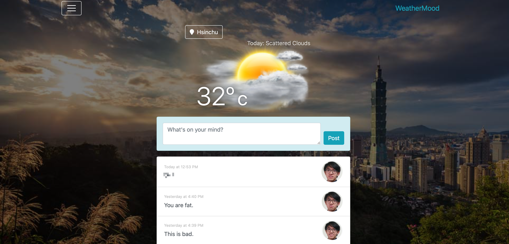
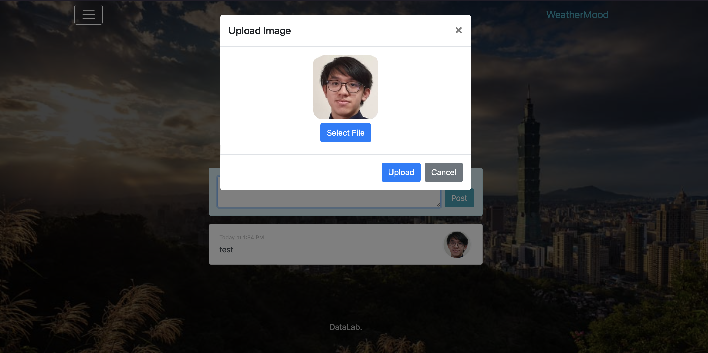

This project customize the toxicity detection function using a self-hosted starGAN model,
which can apply different expression on the uploaded face image.

### StarGAN
StarGAN is a image-to-image multi-domain translation model.
Origin paper: http://openaccess.thecvf.com/content_cvpr_2018/papers/Choi_StarGAN_Unified_Generative_CVPR_2018_paper.pdf

### Tensorflow Serving
Tensorflow serving is a service that enable hosting tensorflow models with a convienent api.
Reference: https://www.tensorflow.org/tfx/serving/serving_basic

### Run this project
After clone the project to local
- Please `npm install` first to get all the package that project may used.
- `npm run start` to run the project.
 

## Requirement

1. (20%) Set preset pictures for three moods: happy / sad / fear
2. (40%) Show the corresponding picture for each mood (You should use the StarGan model to create three pictures for each mood with your own headshot. Put these pictures in ./images/faces)
3. (40%) Can choose any avatar to replace the preset picture and successfully generate pictures with different emotions.

## Submission

1. This is a personal work, submit to the branch of your student id
2. Submit your work to get 100% before 2023/06/08 (Thu) 17:20; 60% before 2023/06/08 23:59

## Note

1. If your program cannot search for the weather (missing key), the score will be 0.
2. When selecting a picture, please use your own headshot as the main one. This is because the generated result will be greatly influenced by the content within the picture. If the picture includes parts other than the head, it may result in an unchanged or inaccurate generated image.